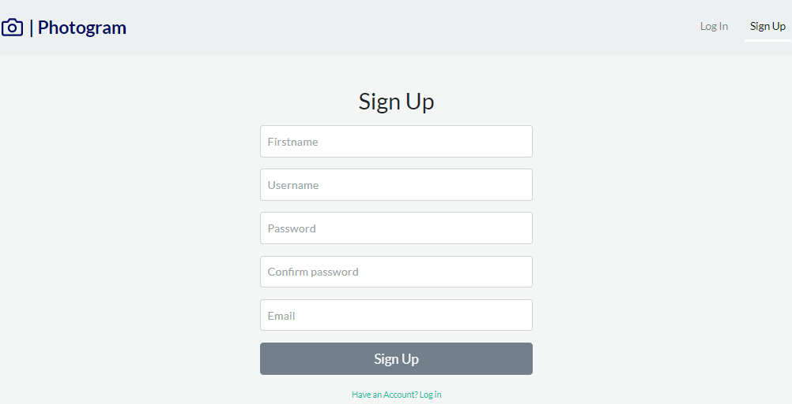
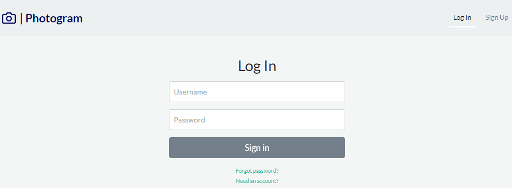
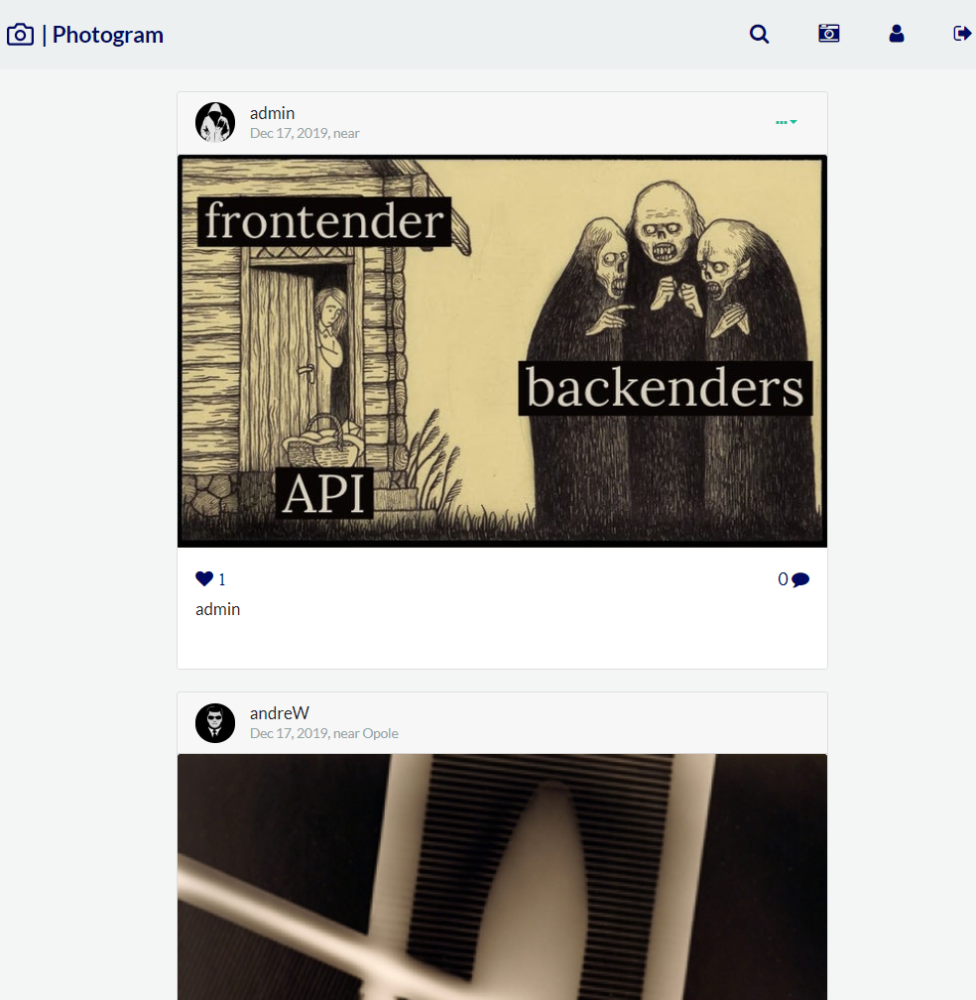
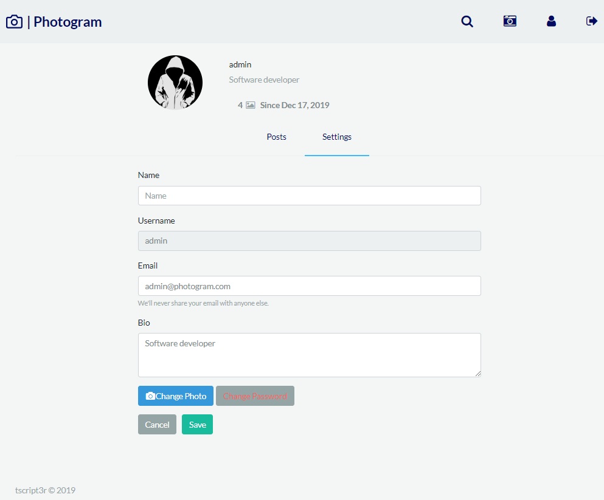
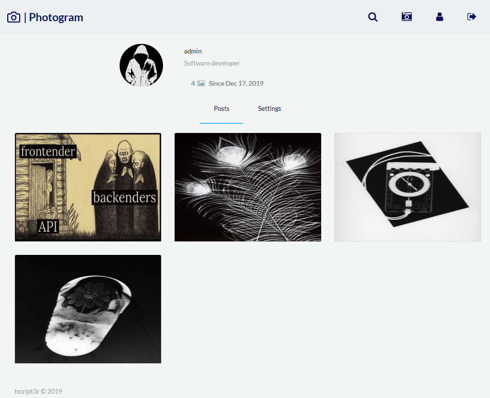
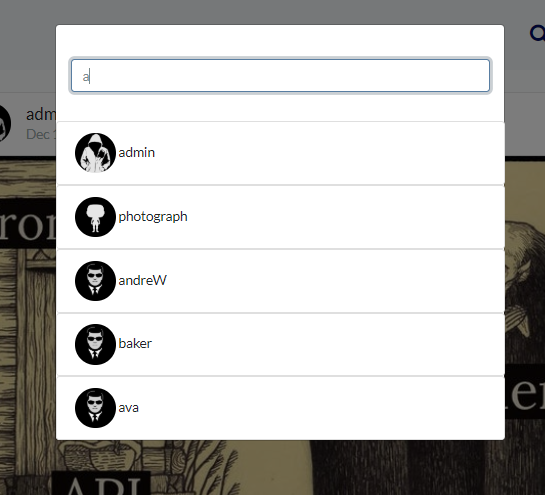

# Photogram [](https://circleci.com/gh/tscript3r/photogram)

### Table of Contents
*    [General info](#general-info)
*    [Technologies](#technologies)
*    [Running locally](#running-locally)
*    [Snapshots](#snapshots)

### General info
Photo sharing web service inspired by Instagram. Main functionalities:
*    New users register
*    Account activation by email confirmation
*    Login in
*    New posts view
*    Adding and removing posts
*    Post likes
*    Post comments
*    Search for users
*    Users accounts viewing
*    Users personal data editing
*    Users avatars

### Technologies
*    Frontend: Angular 8
*    Backend: Java 11, Spring 5 / Boot 2

More details in their modules

### Running locally

###### Java 11 SDK required

* Linux
```
git clone https://github.com/tscript3r/photogram.git
cd photogram
./mvnw package
java -jar backend/target/*.jar
```

* Windows
```
git clone https://github.com/tscript3r/photogram.git
cd photogram
mvnw.cmd package
java -jar backend/target/*.jar
```

By executing maven package goal frontend will be production ready builded and copied into resources of backend, so
that http server of backend runs also the frontend part. Default port is 8080, so after running the jar just visit:
http://localhost:8080

For login you can use following credentials:
*    Username: admin
*    Password: test

### Snapshots











